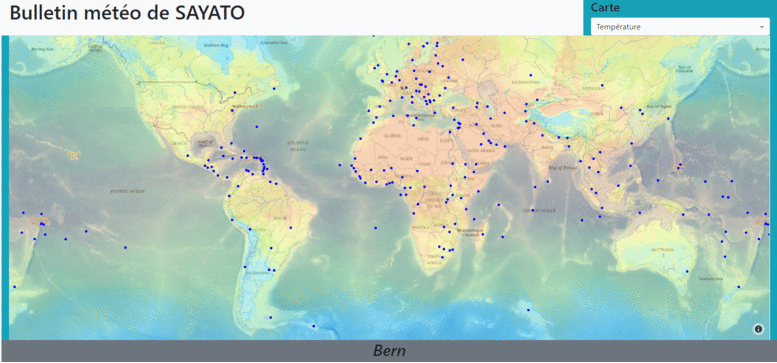
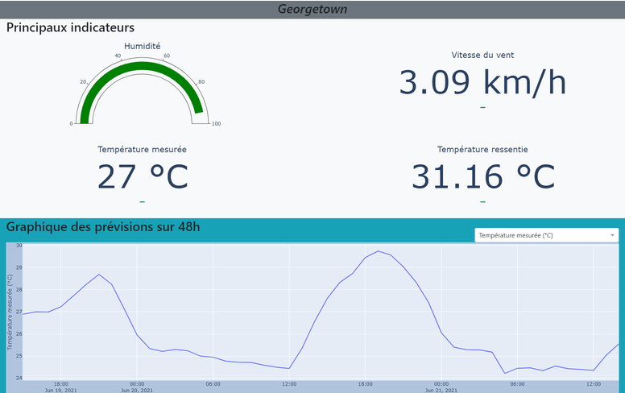
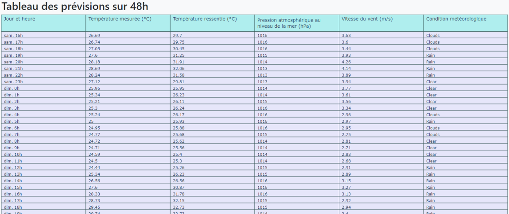
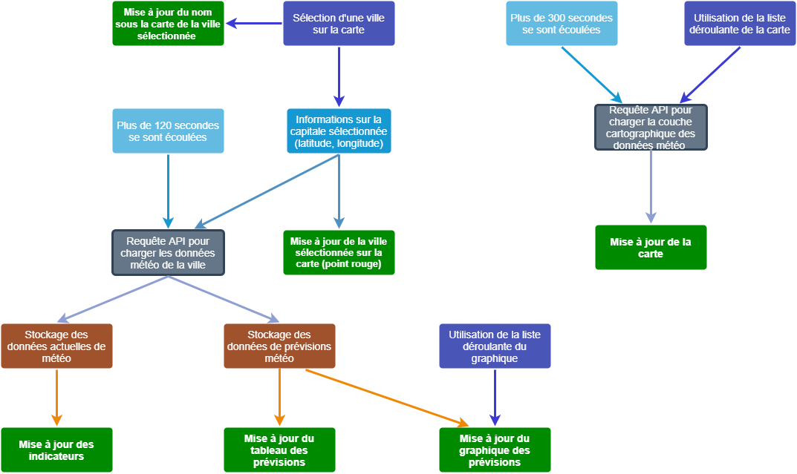

# Un projet pour faire la pluie et le beau temps 

## Objectif du projet 

L'objectif de notre projet était de proposer un tableau de bord en Dash tout en se rajoutant une part de compléxité sur le jeu de données. En effet, plutôt que d'utiliser un open data classique, nous avons décidé de partir sur des données en temps réel disponibles depuis une API. 

**Jeu de données**

Pour choisir le jeu de données nous avons commencé par regarder quelles données étaient accessibles en temps réel et gratuitement. Il fallait aussi que ce soit des données mises à jour très fréquemment pour rendre notre tableau de bord plus intéressant. Nous sommes donc partis sur l'utilisation de données météorologiques. 


Le choix du fournisseur de données s'est porté sur Open Weather Map étant donné la gratuité du service mais aussi le nombre élevé de requêtes par minutes possible de faire sur leur API sans avoir à payer.

De plus, ils mettent à disposition sur leur site des aides pour les développeurs qui souhaitent utiliser leurs données. 

Pour notre projet nous avons utilisé trois sources de données :

-   Dataset des Capitales dans le monde avec leur positions GPS
-   Open Weather : API donnant accès aux informations météo sur une position précise
-   Open Weather : API pour accéder aux couches cartographiques permettant de visualiser des informations météo simultanément sur le monde entier (température, pression, ect...)

> @icon-info-circle La couche cartographique est une sorte d'image transparente permetant de visualiser les données météo dans le monde entier.

**Tableau de bord**

Concernant notre tabeau de bord, nous avions la volonté de faire une carte du monde avec une visualisation des données météo, mise à jour très régulièrement. Elle donnerait également la possibilité de sélectionner une ville précise pour afficher plus de détail sur ses prévisions météo. 

## Lancer le projet

```markdown
1. Télécharger le dossier ZIP contenant le projet
2. Dézipper le projet 
3. Ouvrir le projet sur un éditeur de code (Visual Studio par exemple)
4. Dans votre environnement virtuel tapper la commande :
    pip install -r requirements.txt
5. Lancer le projet (main.app ou avec les launchers)
6. Allez sur localhost 
    Dash is running on http://127.0.0.1:8050/
```
> @icon-info-circle De préférence ouvrir le localhost sur Chrome ou Edge pour que le projet soit entièrement fonctionnel (problème d'affichage du tableau sur Mozilla).

> @icon-exclamation-circle Il est recommandé de créer votre propre compte sur https://openweathermap.org/ et de remplacer l'actuelle clé d'accès dans "config.ini" par votre clé d'accès (api=*numéro de clé d'accès*) si jamais cette erreur s'affiche :


## Utilisation
**Carte**

Le premier élément du tableau de bord est une carte du monde. 
Plusieurs intéractions sont possibles avec la carte : 
-   Passer son curseur sur une capitale pour avoir les informations sur celle-ci
-   Cliquer sur une capitale pour la selectionner 
-   Modifier la variable affichée avec la liste déroulante en haut à droite
-   Zoomer avec la molette pour avoir plus de détails sur la carte




> @icon-info-circle La capitale séléctionnée apparait en rouge et s'affiche en bas de la carte.

**Indicateurs et Prévisions**

Le deuxième élément du tableau de bord est un ensemble de 4 indicateurs suivi par un graphique des prévisions météo sur 48h. 
Lorsqu'une ville est séléctionnée sur la carte, les données des éléments en dessous de la carte sont mises à jour pour afficher les informations sur la ville sélectionnée.
Plusieurs interactions sont possibles avec le graphique de prévisions : 
-   Passer son curseur sur la courbe pour avoir plus d'informations
-   Modifier la variable affichée avec la liste déroulante en haut à droite
-   Zoomer avec la molette pour avoir plus de précisions
-   Sélectionner une zone du graphique sur laquelle zoomer avec une sélection via le clic droit de la souris



**Tableau**

Le dernier élément de notre tableau de bord est un tableau qui affiche le détail des prévisions des prochaines 48h pour la ville sélectionnée sur la carte. 



## Architecture du projet


**Détail de l'architecture**


-   Assets (dossier pour les fichiers de styles)

    -   **favicon.ico** : l'icône d'onglet

    -   **style.css** : contient tout le code css nécessaire au projet.

-   Components (dossier pour les fonctions)

    -   **api.py** : fonctions pour requêter l’API

    -   **app.py** : initialiser l'application Dash
    
    -   **callbacks.py** : fichier destiné aux appels des callbacks, il permet de gérer les données en entrées et sorties puis de faire appel à 'figures.py' si il y a besoin de mettre à jour les éléments graphiques du tableau de bord.

    -   **capitals.py** : lecture du fichier 'concap.csv', utilisé dans plusieurs autres fichiers python
    
    -   **client.py** : fonction de génération de la mise en page (generate layout)
    
    -   **config.py** : stockage des paramètres globaux saisit dans 'config.ini' dans des variables, de cette manière les informations nécessaires peuvent être directement importées sous forme de variables dans les autres fichiers python

    -   **figures.py** : fonctions qui définissent les graphiques et pour les mettre à jour 
    
-   Data (dossier pour les fichiers de données)

    -   **concap.csv** : fichier des données sur les capitales du monde (latitude, longitude, nom, pays, continent)

-   Racine 

    -   **config.init** : initialiser les paramètres globaux. Ce fichier à pour but de bien séparer la partie code et la partie que l’utilisateur pourrait être amené à modifier (exemple la clé d’accès à l’API). L'objectif est également de faciliter la maintenabilité du code.
    > @icon-info-circle Suite à un débat sur le choix des couleurs, il a été décidé de rajouter des variables dans config.ini (marker_color et marker_color_selected) pour que chacun mette la couleur qui lui plaît.
    
    -   **launch.sh** : permet de lancer le 'main.py' sur un système Unix
    
    -   **launch.bat** : permet de lancer le 'main.py' sur un système Windows
    
    -   **main.py** : c’est le noyau du projet, il se sert des autres éléments de l'architecture pour faire tourner le serveur
    
    -   **README.md** : document relatif à la prise en main du projet ayant pour objectif de faciliter son utilisation, sa modification et sa compréhension
     > @icon-info-circle Vous êtes ici.
    
    -   **requirements.txt** : fichier des installations nécessaires à réaliser pour lancer le projet


## Réalisation

**Cartographie des callbacks**




**Exemple code : 'api.py'**

Code permettant de faire la reqûete pour l'API one call pour charger les dataframes current (données météo actuelles) et hourly (données prévisions météo).

```python
def get_current_weather_results(weather_dict: dict):
    """Extraction des données currentes du dictionnaire des résultats météo global"""

    current = pd.Series(weather_dict['current'])
    current['dt'] = dt.datetime.fromtimestamp(current['dt'])
    current['sunrise'] = dt.datetime.fromtimestamp(current['sunrise'])
    current['sunset'] = dt.datetime.fromtimestamp(current['sunset'])
    current['weather_condition'] = current['weather'][0]['main']
    current['weather_icon'] = current['weather'][0]['icon']
    current.drop(['weather'], inplace=True)

    return current

def get_hourly_weather_results(weather_dict: dict):
    """Extraction des données horaires prévisionnelles du dictionnaire des résultats météo global"""

    hourly = pd.DataFrame(weather_dict['hourly'])
    hourly.loc[:,'weather_condition'] = hourly['weather'].map(lambda ls: ls[0]['main'])
    hourly.loc[:,'weather_icon'] = hourly['weather'].map(lambda ls: ls[0]['icon'])
    hourly.drop(columns=['weather'], inplace=True)
    hourly.loc[:,'dt'] = hourly['dt'].map(dt.datetime.fromtimestamp)
    
    return hourly

def get_weather_results(lat: float, lon: float, one_call_api_base_url: str, api_key: str):
    """Obtention des résultats météo currents et prévisionnels"""
    
    url = one_call_api_base_url.format(lat, lon, api_key)
    response = json.loads(requests.get(url).text)
    if response.get('cod') and response.get('cod') == 429:
        raise Exception("Compte OpenWeather bloqué et pas de dictionnaire par défaut")
    else:
        weather_dict = response
    current = get_current_weather_results(weather_dict)
    hourly = get_hourly_weather_results(weather_dict)

    return current, hourly

```
**Aides au développement**
>  @icon-info-circle Documentation de l'API one call Open Weather Map : https://openweathermap.org/api/one-call-api

>  @icon-info-circle Documentation de l'API Open Weather Map pour charger les couches cartographiques : https://openweathermap.org/api/weathermaps

>  @icon-info-circle Site de l'API pour les fonds de carte : https://basemap.nationalmap.gov/arcgis/rest/services


## Conclusion

Nous nous sommes lancés sur un projet très ambitieux. En effet, utiliser des données en temps réel depuis une API était nouveau pour nous et cela s'est révélé parfois complexe. Cependant, nous avons su nous adapter et arriver à proposer un résultat dont nous sommes très satisfaits. 

Nous avons réussi à mettre en place tout ce qui était prévu même s'il a parfois fallu s'adapter à ce que proposait gratuitement l'API et au nombre de requêtes maximum qu'il nous était possible d'effectuer. 

Une piste d'amélioration possible serait de mettre une limite au nombre de fois dans une minute où un utilisateur peut sélectionner une ville ou une couche cartographique dans la liste déroulante. Ceci dans le but de ne pas faire trop de requêtes API pour respecter la limite imposée par Open Weather Map. De plus, nous aurions aimé ajouter une barre d'îcônes en fonction du temps sous le graphique des prévisions. 


